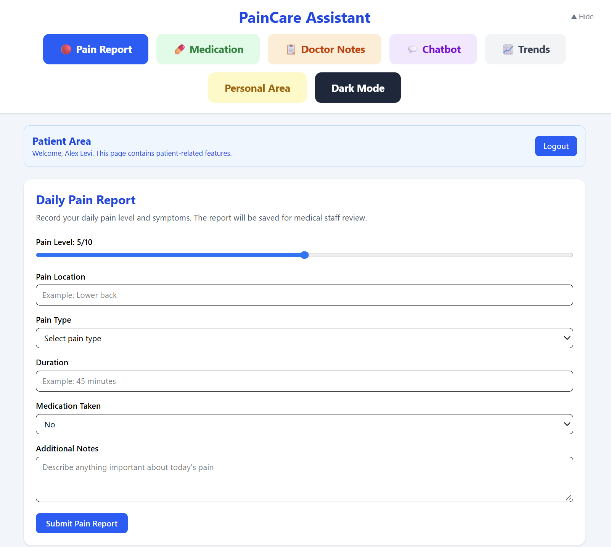
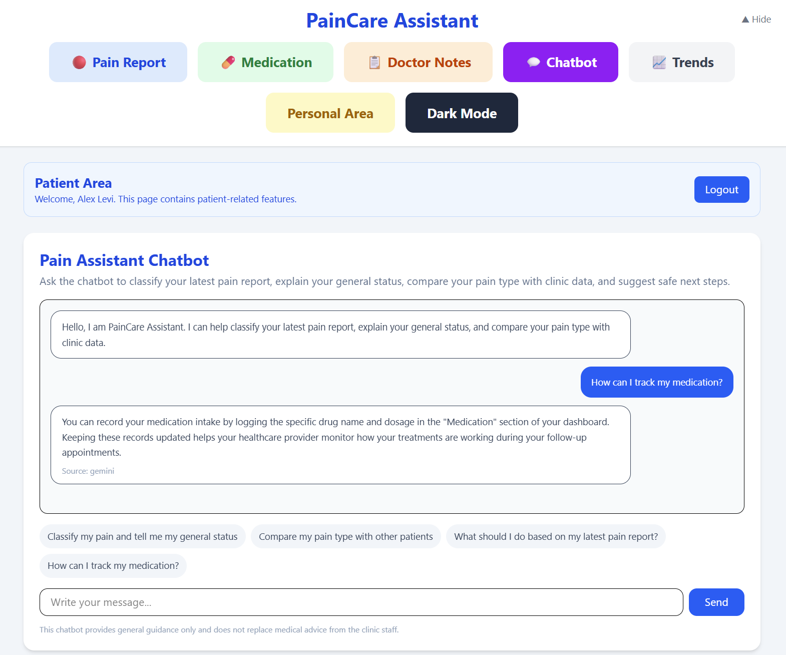
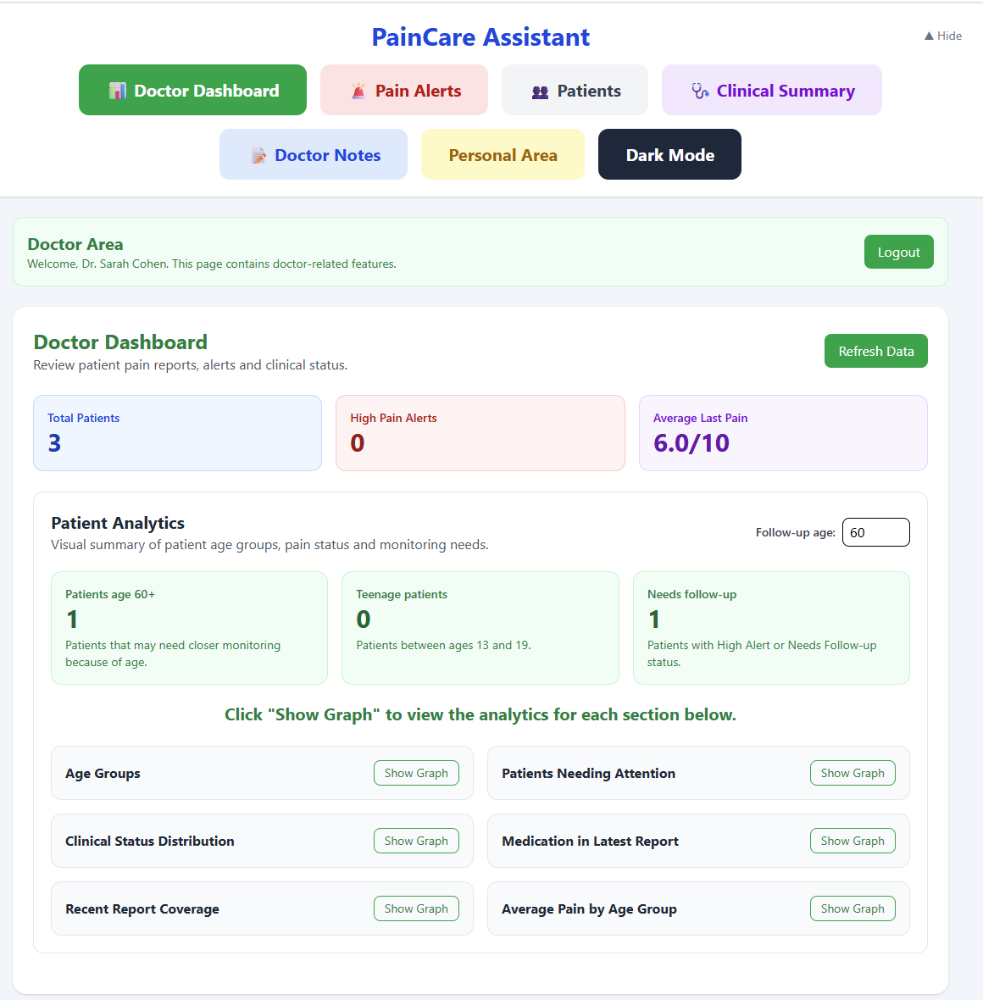
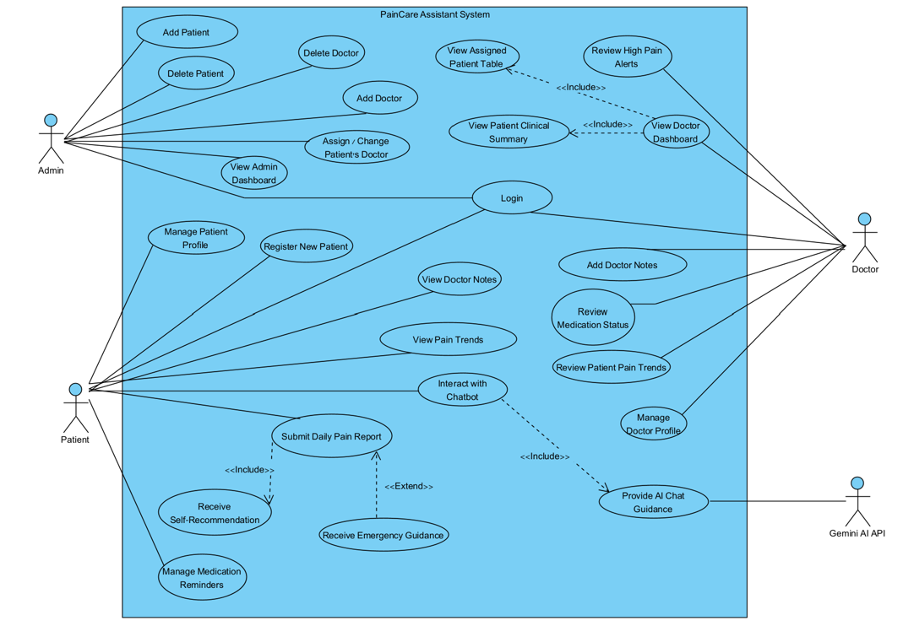

# PainCare Assistant

A full-stack web application for chronic pain tracking and pain-clinic management.

PainCare Assistant allows patients to report and monitor their pain, manage medication reminders, view pain trends, communicate with an AI-assisted chatbot, and receive notes from their doctor. Doctors can monitor assigned patients through a dedicated dashboard, while administrators manage users and patient-doctor assignments.

🌐 **Live Demo:**  
https://pain-management-project-topaz.vercel.app/

---

## Features

### Patient
- Register and log in
- Submit daily pain reports
- Track pain history, trends, and statistics
- Manage medication reminders
- View doctor notes
- Update personal profile information
- Receive guidance for high pain levels
- Interact with an AI-assisted chatbot
- Dark Mode support

### Doctor
- View assigned patients
- Review patient pain reports
- Monitor high-pain alerts
- View patient clinical summaries
- Review pain trends and medication status
- Add clinical notes
- Manage doctor profile

### Admin
- Manage doctors and patients
- Add or remove users
- Assign patients to doctors
- Change patient-doctor assignments

---
## Application Preview

### Patient – Daily Pain Report

Patients can record their daily pain level, location, type, duration, medication status, and additional notes for follow-up by medical staff.



### AI-Assisted Chatbot

The patient chatbot integrates with Google Gemini to provide general, non-diagnostic guidance based on the patient's pain information.



### Doctor Dashboard

Doctors can monitor assigned patients, review pain alerts and clinical summaries, and view patient analytics from a dedicated dashboard.


## Tech Stack

### Frontend
- React
- Vite
- JavaScript
- React Hooks
- Tailwind CSS

### Backend
- Node.js
- Express.js
- REST API

### Database
- MongoDB

### AI Integration
- Google Gemini API

### Deployment
- **Frontend:** Vercel
- **Backend:** Render

---

## Architecture

```text
Patient / Doctor / Admin
          │
          ▼
   React + Vite Frontend
          │
       REST API
          │
          ▼
 Node.js + Express Backend
       │             │
       ▼             ▼
    MongoDB     Google Gemini API
```

The frontend communicates with the backend through REST APIs. The backend manages application data in MongoDB and communicates with the Gemini API for chatbot functionality.

---

## System Use Case Diagram

The diagram below illustrates the main interactions between patients, doctors, administrators, and the external Gemini AI service.



The editable Visual Paradigm source file is available in the `docs` directory.

---

## Project Structure

```text
pain-management-project/
├── paincare-assistant/             # React / Vite frontend
├── server/                         # Node.js / Express backend
├── docs/
│   ├── screenshots/
│   │   ├── patient-pain-report.png
│   │   ├── ai-chatbot.png
│   │   └── doctor-dashboard.png
│   ├── PainCare_Project_Report.docx
│   ├── PainCareAssistant_Assignment3.vpp
│   └── use-case-diagram.png
├── .gitignore
└── README.md
```

---

## Documentation

Additional project documentation and design files are available in the [`docs`](docs/) directory.

- [Project Report](docs/PainCare_Project_Report.docx)
- [Use Case Diagram](docs/use-case-diagram.png)
- Visual Paradigm source: `docs/PainCareAssistant_Assignment3.vpp`

---

## Project Context

PainCare Assistant was developed as a **team project** for the **Advanced Web Technologies (61776)** course at Braude College of Engineering.

The project included requirements analysis, system architecture, database design, use-case modeling, frontend and backend development, AI integration, usability evaluation, code review, and deployment.

This repository is a maintained fork of the original team repository.

---

## Medical Disclaimer

PainCare Assistant is an educational software project and is not a certified medical system.

The AI-assisted chatbot provides general, non-diagnostic guidance and should not be used as a substitute for professional medical diagnosis, treatment, or emergency medical care.

---

## Live Application

👉 **[Open PainCare Assistant](https://pain-management-project-topaz.vercel.app/)**

---

## Maintained By

**Adel Bashir**  
B.Sc. Software Engineering Student  
Braude College of Engineering

[LinkedIn](https://www.linkedin.com/in/adel-bashir/)
